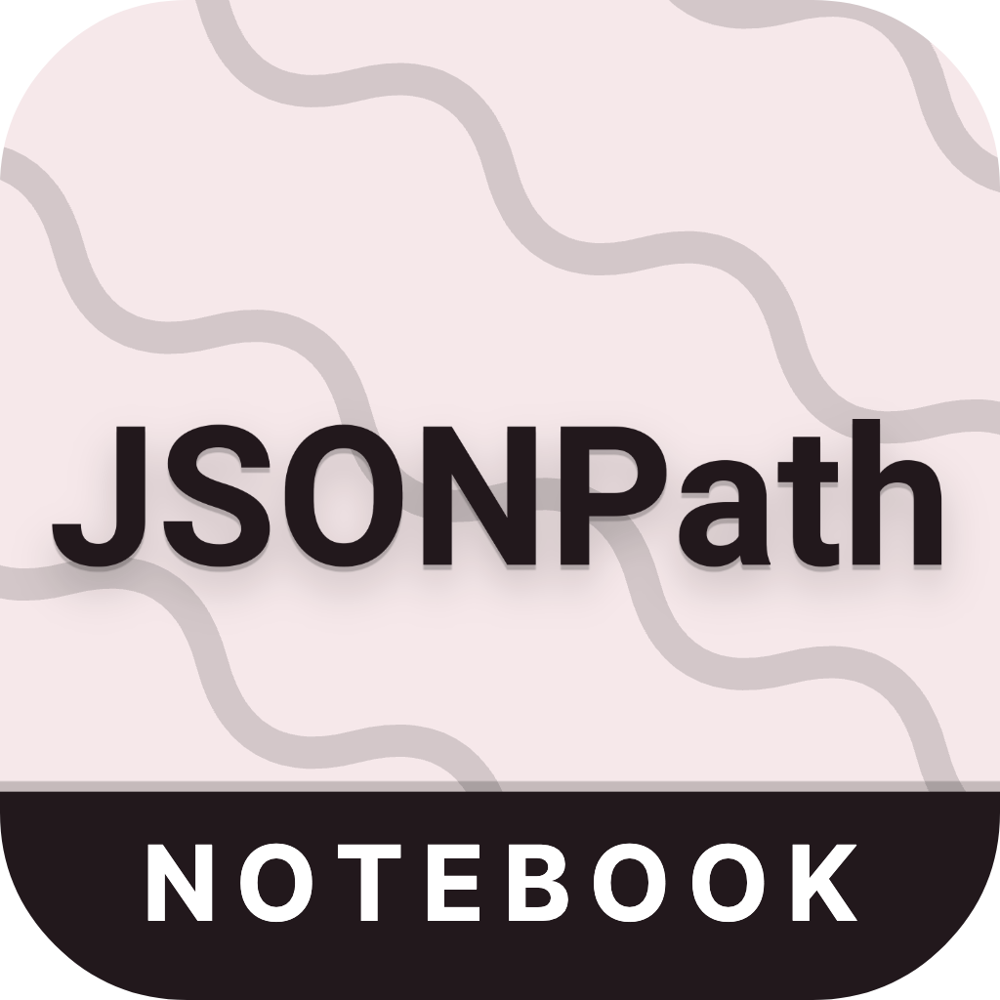

<p align="center">
  <a href="https://marketplace.visualstudio.com/items?itemName=tschranz.jsonpath-notebook">
    
  </a>
</p>
<p align="center">
  <h1 align="center">JSONPath Notebook<br>for Visual Studio Code</h1>
  <p align="center">
    A Visual Studio Code Extension for running JSONPath queries inside Notebooks.
  </p>
</p>


## Features

- quickly run JSONPath queries on your JSON files
- annotate and organize queries using [Markdown cells](#markdown-support)
- allows you to use a [different .json input file for each query](#switching-input-file-context)
- [open query result](#open-output) in a new document to save or further edit
- 100% compliant with the JSONPath Standard [RFC 9535](https://www.rfc-editor.org/rfc/rfc9535.html)
- store and share notebook files `.jsonpath-notebook`
- switch between standard compliant syntax and [extended syntax](#extended-syntax)

## Installation

Install the extension through the VS Code marketplace.
[https://marketplace.visualstudio.com/items?itemName=tschranz.jsonpath-notebook](https://marketplace.visualstudio.com/items?itemName=tschranz.jsonpath-notebook) or just search for `JSONPath Notebook` inside the Extension Pane.

If you prefer not to use the Microsoft Marketplace you can also install the extension directly:

1. Go to the [Releases page](https://github.com/mesarth/JSONPath-Notebook/releases) of the Repository and download the latest `.vsix` file.
2. Install the extension by either running the VS Code command `Developer: Install Extension from Location` and selecting the .visx file or by running the command `code --install-extension <filename>.visx`

## Usage

### Creating a new Notebook

After installation a popup should appear, asking you to create a new notebook.

You can also create a new notebook by using the command `JSONPath Notebook: Open new Notebook` or creating a file with the `.jsonpath-notebook` ending.


### Switching input file (context)

On the first execution of a cell, the input file is determined as follows

- by default the JSON file opened in the editor will be used
  - if there is more than one JSON file opened in the editor, a popup appears asking to select a file
  - there is also an option in this popup to select a file from the file system
- if there is no JSON file opened, a popup appears asking to select a file

The chosen context (input file) gets saved inside the notebook (per cell) and can be changed at any time by clicking on the corresponding button in the lower right of the cell.


### Open output

The result of a query can be opened in a new file by clicking the button `Open output in new tab` in the lower left of the cell.


### Markdown support

JSONPath Notebook supports Markdown formatted cells. To add a new Markdown cell press the button `+ Markdown` or run the command `Notebook: Insert Markdown Cell Above/Below`. For an introduction to the Markdown syntax see [Github Markdown Guide](https://docs.github.com/en/get-started/writing-on-github/getting-started-with-writing-and-formatting-on-github/basic-writing-and-formatting-syntax#quoting-code).


### Extended Syntax Mode

JSONPath Notebook aims to be fully compliant with the JSONPath Standard [RFC 9535](https://www.rfc-editor.org/rfc/rfc9535.html). However, some use cases may require functionality that is not part of the standard. JSONPath Notebook provides the ability to switch to an extended syntax mode, which supports additional functionality. 

Standard syntax mode allows only [standard-compliant](https://www.rfc-editor.org/rfc/rfc9535.html) JSONPath syntax. Extended syntax mode allows additional non-standard syntax, such as the keys selector operator `~` or the current key identifier `#`. Take a look at the [JSON P3 documentation](https://jg-rp.github.io/json-p3/guides/jsonpath-extra) for more information about the supported syntax.

The syntax mode can be changed for each notebook cell by clicking on the respective icon in the cell's status bar. The default setting can be changed in the [Settings](#default-syntax-mode).


## JSONPath Syntax

See [RFC 9535](https://www.rfc-editor.org/rfc/rfc9535) for the full JSONPath standard.

<details>
  <summary>Here are some examples:</summary>

```json
{ "store": {
    "book": [
      { "category": "reference",
        "author": "Nigel Rees",
        "title": "Sayings of the Century",
        "price": 8.95
      },
      { "category": "fiction",
        "author": "Evelyn Waugh",
        "title": "Sword of Honour",
        "price": 12.99
      },
      { "category": "fiction",
        "author": "Herman Melville",
        "title": "Moby Dick",
        "isbn": "0-553-21311-3",
        "price": 8.99
      },
      { "category": "fiction",
        "author": "J. R. R. Tolkien",
        "title": "The Lord of the Rings",
        "isbn": "0-395-19395-8",
        "price": 22.99
      }
    ],
    "bicycle": {
      "color": "red",
      "price": 399
    }
  }
}
```

| JSONPath                                    | Intended Result |
----------------------------------------------|------------------
| $.store.book[*].author                      | the authors of all books in the store |
| $..author                                   |	all authors |
| $.store.*	                                  | all things in the store, which are some books and a red bicycle |
| $.store..price                              | the prices of everything in the store |
| $..book[2]                                  | the third book |
| $..book[2].author	                          | the third book's author |
| $..book[2].publisher	                      | empty result: the third book does not have a "publisher" member |
| $..book[-1]	                                | the last book in order |
| <span>$..book[0,1] <br> $..book[:2]</span>  | the first two books |
| $..book[?@.isbn]	                          | all books with an ISBN number |
| $..book[?@.price<10]	                      | all books cheaper than 10 |
| $..*	                                      | all member values and array elements contained in the input value |

</details>

## Extension Settings

### Use Relative Paths

When set to `true` the notebook will save the paths to input files relative to the location of the notebook file itself. This is particularly useful for sharing notebooks and input files as a package because it ensures that the links to input files will work on different machines and directories.

| Setting ID                         | Options          | Default |
|------------------------------------|------------------| ------- |
|`jsonpath-notebook.useRelativePaths`| `true` or `false`| `true`  |

### Default Syntax Mode

Sets the [default syntax](#extended-syntax-mode) mode for new notebook cells.

| Setting ID                          | Options                              | Default         |
|-------------------------------------|--------------------------------------|-----------------|
|`jsonpath-notebook.defaultSyntaxMode`|`Standard syntax` or `Extended syntax`|`Standard syntax`|

## JSONPath engine

JSONPath Notebook uses the [json-p3](https://github.com/jg-rp/json-p3) JSONPath engine for querying JSON files. The engine implements the JSONPath standard as defined in [RFC 9535](https://www.rfc-editor.org/rfc/rfc9535.html).

Before version 2.0 the extension used [brunerd's jsonpath engine](https://github.com/brunerd/jsonpath). That version did not implement the full JSONPath standard. Queries created with the old engine may need to be adjusted to work with the new engine.

## Release Notes

See [Changelog.md](https://github.com/mesarth/JSONPath-Notebook/blob/main/CHANGELOG.md)

## Issue Reporting and Feature Requests

Found a bug? Have a feature request? Reach out on our [GitHub Issues page](https://github.com/mesarth/JSONPath-Notebook/issues).
