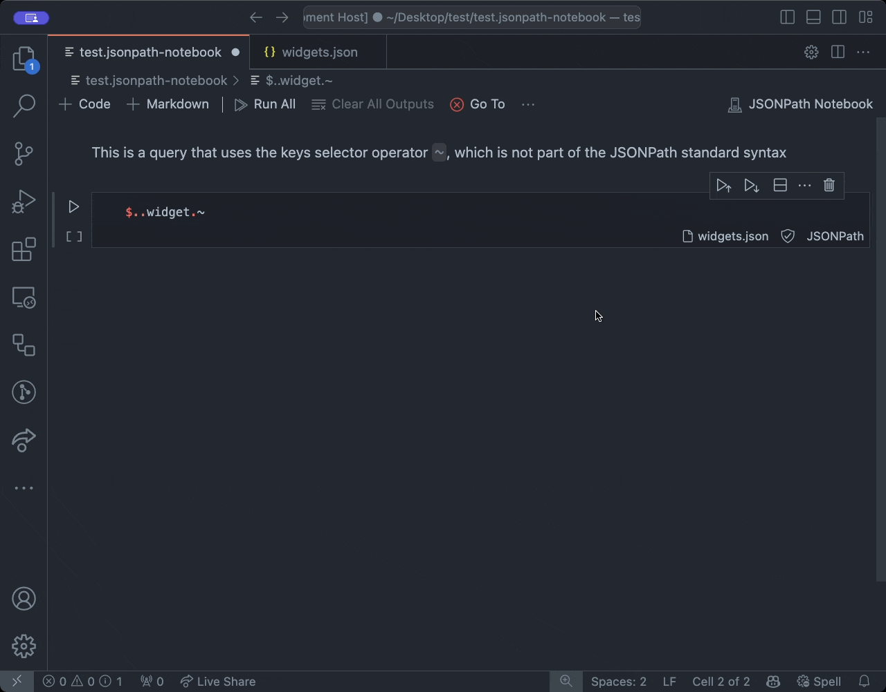

<p align="center">
  <a href="https://marketplace.visualstudio.com/items?itemName=tschranz.jsonpath-notebook">
    
  </a>
</p>
<div align="center">
  <h1 align="center">JSONPath Notebook<br>for Visual Studio Code</h1>
  <p align="center">
    A Visual Studio Code Extension for running JSONPath queries inside Notebooks.
  </p>

  [](https://marketplace.visualstudio.com/items?itemName=tschranz.jsonpath-notebook)

</div>


## Features

- Quickly run JSONPath queries on your `.json` files
- Annotate and organize queries using [Markdown cells](#markdown-support)
- Use a [different .json input file for each query](#switching-input-file-context)
- [Open the query result](#open-output) in a new document to save or further edit
- 100% compliant with the JSONPath Standard [RFC 9535](https://www.rfc-editor.org/rfc/rfc9535.html)
- Store and share notebook files `.jsonpath-notebook`
- Switch between standard-compliant syntax and [extended syntax](#extended-syntax)

## Installation

Install the extension through the VS Code marketplace.

[https://marketplace.visualstudio.com/items?itemName=tschranz.jsonpath-notebook](https://marketplace.visualstudio.com/items?itemName=tschranz.jsonpath-notebook) 

Or just search for `JSONPath Notebook` inside the Extension Pane.

If you prefer not to use the Microsoft Marketplace you can also install the extension directly:

1. Go to the [Releases page](https://github.com/mesarth/JSONPath-Notebook/releases) of the Repository and download the latest `.vsix` file.
2. Install the extension by either running the VS Code command `Developer: Install Extension from Location` and selecting the .visx file or by running the command `code --install-extension <filename>.visx`

## Usage

### Creating a new Notebook

Right click in the file explorer and create a new file with an `.jsonpath-notebook` extension. 

Or, open the Command Palette and run the command `JSONPath Notebook: Open new Notebook`.

If you have an existing notebook file, you can just open it.


### Switching input file (context)

JSONPath Notebook tries to automatically figure out which `.json` input file you want the query to run on.

If there is a single `.json` file open in the editor, it will be selected automatically. Otherwise, you will be asked to select a file.

The input file can be changed for each cell by clicking on the corresponding button in the lower right of the cell.


### Open output

The result of a query can be opened in a new file by clicking the button `Open output in new tab` in the lower left of the cell.


### Markdown support

JSONPath Notebook supports Markdown formatted cells. To add a new Markdown cell press the button `+ Markdown` or run the command `Notebook: Insert Markdown Cell Above/Below`. For an introduction to the Markdown syntax see [Github Markdown Guide](https://docs.github.com/en/get-started/writing-on-github/getting-started-with-writing-and-formatting-on-github/basic-writing-and-formatting-syntax#quoting-code).


### Extended Syntax Mode

JSONPath Notebook aims to be fully compliant with the JSONPath Standard [RFC 9535](https://www.rfc-editor.org/rfc/rfc9535.html). However, certain use cases may require additional functionality not included in the standard. JSONPath Notebook gives you the ability to switch to an extended syntax mode, which supports additional functionality. 

Standard syntax mode allows only [standard-compliant](https://www.rfc-editor.org/rfc/rfc9535.html) JSONPath syntax. Extended syntax mode allows additional non-standard syntax, such as the keys selector operator `~` or the current key identifier `#`. Take a look at the [JSON P3 documentation](https://jg-rp.github.io/json-p3/guides/jsonpath-extra) for more information about the supported syntax.

Syntax mode can be changed for each notebook cell by clicking on the respective icon in the cell's status bar. The default setting can be changed in the [Settings](#default-syntax-mode).



## JSONPath Syntax

See [RFC 9535](https://www.rfc-editor.org/rfc/rfc9535) for the full JSONPath standard.

<details>
  <summary>Here are some examples:</summary>

```json
{ "store": {
    "book": [
      { "category": "reference",
        "author": "Nigel Rees",
        "title": "Sayings of the Century",
        "price": 8.95
      },
      { "category": "fiction",
        "author": "Evelyn Waugh",
        "title": "Sword of Honour",
        "price": 12.99
      },
      { "category": "fiction",
        "author": "Herman Melville",
        "title": "Moby Dick",
        "isbn": "0-553-21311-3",
        "price": 8.99
      },
      { "category": "fiction",
        "author": "J. R. R. Tolkien",
        "title": "The Lord of the Rings",
        "isbn": "0-395-19395-8",
        "price": 22.99
      }
    ],
    "bicycle": {
      "color": "red",
      "price": 399
    }
  }
}
```

| JSONPath                                    | Intended Result |
----------------------------------------------|------------------
| $.store.book[*].author                      | the authors of all books in the store |
| $..author                                   |	all authors |
| $.store.*	                                  | all things in the store, which are some books and a red bicycle |
| $.store..price                              | the prices of everything in the store |
| $..book[2]                                  | the third book |
| $..book[2].author	                          | the third book's author |
| $..book[2].publisher	                      | empty result: the third book does not have a "publisher" member |
| $..book[-1]	                                | the last book in order |
| <span>$..book[0,1] <br> $..book[:2]</span>  | the first two books |
| $..book[?@.isbn]	                          | all books with an ISBN number |
| $..book[?@.price<10]	                      | all books cheaper than 10 |
| $..*	                                      | all member values and array elements contained in the input value |

</details>

## Extension Settings

### Use Relative Paths

This setting determines how file paths are stored for each notebook cell that references an input file. When enabled, file paths are saved relative to the notebook's location. When disabled, absolute file paths are used instead.

Relative file paths are generally preferred because they make the notebook more portable. This allows you to move the notebook and input files together without breaking the file references.

Absolute file paths, on the other hand, contain the full path from the root directory. This can be useful if you want to reference files in specific, fixed locations, regardless of where the notebook is moved.

| Setting ID                         | Options          | Default |
|------------------------------------|------------------| ------- |
|`jsonpath-notebook.useRelativePaths`| `true` or `false`| `true`  |

### Default Syntax Mode

Sets the default [syntax mode](#extended-syntax-mode) for new notebook cells.

| Setting ID                          | Options                              | Default         |
|-------------------------------------|--------------------------------------|-----------------|
|`jsonpath-notebook.defaultSyntaxMode`|`Standard syntax` or `Extended syntax`|`Standard syntax`|

## JSONPath engine

JSONPath Notebook uses the [json-p3](https://github.com/jg-rp/json-p3) JSONPath engine for querying JSON files. The engine implements the JSONPath standard as defined in [RFC 9535](https://www.rfc-editor.org/rfc/rfc9535.html).

Before version 2.0, the extension used [brunerd's jsonpath engine](https://github.com/brunerd/jsonpath). That version did not implement the full JSONPath standard. Queries created with the old engine may need to be adjusted to work with the new engine.

## Release Notes

See [Changelog.md](https://github.com/mesarth/JSONPath-Notebook/blob/main/CHANGELOG.md)

## Issue Reporting and Feature Requests

Found a bug? Have a feature request? Reach out on our [GitHub Issues page](https://github.com/mesarth/JSONPath-Notebook/issues).
